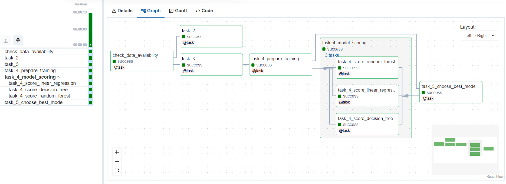

# Weather ML Pipeline with Apache Airflow

🌤️ **Complete weather data pipeline with machine learning model training using Apache Airflow 2.8.1**



## 🎯 Project Overview

This project implements a comprehensive data pipeline that:
- **Collects** weather data from OpenWeatherMap API
- **Transforms** raw JSON data into structured CSV datasets  
- **Trains** multiple ML regression models in parallel
- **Selects** the best performing model automatically
- **Saves** the final trained model for production use

## 🏗️ Architecture

### Two complementary DAGs:

1. **`weather_data_collection`** - Automated data collection
   - Schedule: Every 2 minutes (`*/2 * * * *`)
   - Continuously feeds weather data for training

2. **`weather_training_pipeline`** - ML training pipeline  
   - Schedule: Manual execution
   - Complete data processing and model training workflow

## 🚀 Installation & Setup

### Step 1: Create Virtual Machine

> **⚠️ Important**: Airflow requires significant resources. Use minimum **2 vCPU & 4GB RAM**

**Option A: AWS EC2**
```bash
# Launch Ubuntu 20.04/22.04 LTS instance
# Minimum: t3.medium (2 vCPU, 4GB RAM)
# Security Group: Open port 8080 for Airflow UI
```

**Option B: Google Cloud Platform**
```bash
# Create Compute Engine instance
# Machine type: e2-medium (2 vCPU, 4GB RAM)  
# OS: Ubuntu 20.04/22.04 LTS
# Firewall: Allow HTTP traffic on port 8080
```

**Option C: Local Ubuntu VM**
- VirtualBox/VMware with Ubuntu 20.04+
- Minimum 4GB RAM, 2 CPUs recommended

### Step 2: Install Docker & Docker Compose

```bash
# Update system
sudo apt update && sudo apt upgrade -y

# Install Docker
curl -fsSL https://get.docker.com -o get-docker.sh
sudo sh get-docker.sh
sudo usermod -aG docker $USER

# Install Docker Compose
sudo apt install docker-compose -y

# Reboot to apply group changes
sudo reboot
```

### Step 3: Setup Airflow Environment

```bash
# Create working directory
mkdir airflow_dst && cd airflow_dst

# Download docker-compose configuration
wget https://dst-de.s3.eu-west-3.amazonaws.com/airflow_fr/docker-compose/docker-compose.yaml

# Create required directories
mkdir ./dags ./logs ./plugins

# Set permissions
sudo chmod -R 777 logs/ dags/ plugins/

# Create environment file
echo -e "AIRFLOW_UID=$(id -u)\nAIRFLOW_GID=0" > .env
```

### Step 4: Initialize & Launch Airflow

```bash
# Initialize Airflow database
docker-compose up airflow-init

# Start all Airflow services (wait ~5 minutes)
docker-compose up -d

# Verify all containers are healthy
docker container ls
```

### Step 5: Access Airflow UI

- **URL**: `http://YOUR_VM_IP:8080`
- **Login**: `airflow` / `airflow`
- Wait for all containers to be "healthy" before accessing

### Step 6: Download Airflow CLI Script

```bash
# Download utility script
wget https://dst-de.s3.eu-west-3.amazonaws.com/airflow_avance_fr/docker-compose/airflow.sh
chmod +x airflow.sh

# Usage examples:
./airflow.sh --help    # CLI commands
./airflow.sh bash      # Shell access  
./airflow.sh python    # Python shell
```

### Step 7: Deploy Project DAGs

```bash
# Clone this repository
git clone https://github.com/arthurcornelio88/airflow-weather-ml-pipeline.git
cd airflow-weather-ml-pipeline

# Copy DAGs to Airflow
cp -r dags/* /path/to/airflow_dst/dags/

# Create data directories
mkdir -p /path/to/airflow_dst/{raw_files,clean_data}
```

## ⚙️ Configuration & Usage

### Configure API Access

1. **Get OpenWeatherMap API Key**:
   - Sign up at [OpenWeatherMap](https://openweathermap.org/api)
   - Get your free API key

2. **Set Airflow Variables** (via UI: Admin → Variables):
   ```json
   API_KEY: "your_openweathermap_api_key_here"
   cities: ["paris", "london", "washington", "belo horizonte"]
   ```

### Run the Pipeline

1. **Start Data Collection**:
   - In Airflow UI, enable `weather_data_collection` DAG
   - Let it run for ~15 minutes to collect sufficient data (15+ observations)

2. **Train ML Models**:
   - Manually trigger `weather_training_pipeline` DAG  
   - Watch the complete pipeline: validation → transformation → parallel ML training → model selection

3. **Monitor Execution**:
   - Check logs in Airflow UI for detailed execution information
   - Find trained models in `/clean_data/best_model.joblib`

### Usage
## 🔧 Technical Features

- **🎯 Task Decorators**: Modern Airflow 2.0+ syntax with `@dag` and `@task`
- **📦 TaskGroup**: Parallel model training for efficiency
- **🔄 XCom Integration**: Implicit parameter passing between tasks
- **🐳 Docker Volumes**: Clean data separation with `/app/` mounting
- **🛡️ Robust Pipeline**: Data validation, error handling, adaptive CV
- **📊 Model Selection**: Automatic best model selection based on cross-validation scores

## 📚 Documentation

Detailed documentation available in `/docs`:

- **[📋 Instructions](docs/instructions.md)** - Complete project walkthrough
- **[📈 Results](docs/results.md)** - Execution logs and technical analysis

## 🤖 ML Models Supported

- Linear Regression
- Decision Tree Regressor  
- Random Forest Regressor

Models are trained in parallel using TaskGroup and the best performer is automatically selected based on cross-validation scores.

## 📊 Project Structure

```
airflow_dst/
├── dags/
│   ├── weather_collection.py     # Data collection DAG
│   ├── weather_training_pipeline.py # ML training DAG
│   └── utils/
│       ├── weather_helpers.py    # API & transformation functions
│       └── train_helpers.py      # ML training functions
├── docker-compose.yaml           # Airflow infrastructure
├── raw_files/                    # Weather data (JSON)
├── clean_data/                   # Processed data (CSV) + models
└── logs/                         # Airflow logs
```

## 🏆 Results

With 136+ weather observations, the pipeline successfully:
- ✅ Collected and transformed weather data from 4 cities
- ✅ Trained 3 ML models in parallel using TaskGroup
- ✅ Selected Linear Regression as best performer (score: -3.55)
- ✅ Saved final model for production use

## 📄 License

This project is for educational purposes as part of an Apache Airflow course evaluation.
