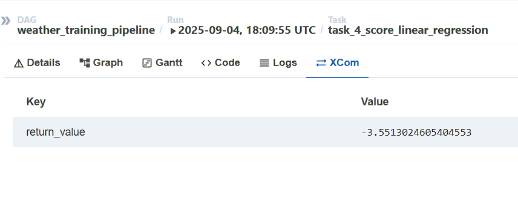
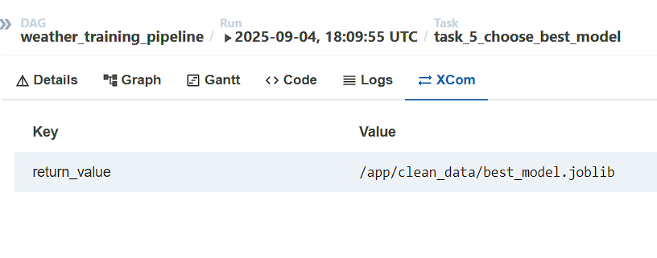
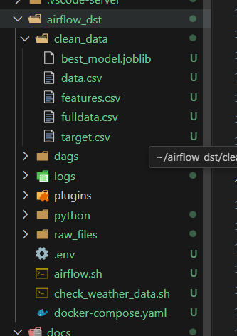

# Weather ML Pipeline - Execution Results

## 🏗️ Project Architecture

### Design Choice: Two Complementary DAGs

**Why two separate DAGs?**

1. **`weather_data_collection`** (Automated collection)
   - **Schedule**: `*/2 * * * *` - Collects every 2 minutes
   - **Role**: Continuously feed the weather database
   - **Recommended duration**: 15+ minutes to accumulate ≥15 observations

2. **`weather_training_pipeline`** (ML pipeline)
   - **Schedule**: `None` - Manual execution on demand
   - **Role**: Data processing and ML training when sufficient data available
   - **Advantage**: Avoids unnecessary executions without sufficient data

### Key Technologies Used

#### 🎯 Airflow 2.0+ Decorators
```python
@dag(dag_id='weather_training_pipeline', schedule_interval=None, ...)
def weather_training_pipeline():
    
    @task
    def check_data_availability():
        # Verification logic
        return {"total_observations": count}
```

**Advantages of decorators:**
- Cleaner and more pythonic code
- Automatic implicit XCom
- Native Python type handling
- Easier debugging

#### 🐳 Docker Compose Configuration
```yaml
volumes:
  - ./raw_files:/app/raw_files      # Raw data
  - ./clean_data:/app/clean_data    # Transformed data
```

**Why `/app/...` instead of `/opt/airflow/...`?**
- **Isolation**: Separation of Airflow data and business data
- **Host-container sharing**: Direct access to files from host
- **Persistence**: Data survives container restarts

## 🚦 Execution Results

### Data Verification (Gate condition)

```
[2025-09-04, 17:55:31 UTC] {logging_mixin.py:188} INFO - Found 34 weather data files
[2025-09-04, 17:55:31 UTC] {logging_mixin.py:188} INFO - Total observations available: 136
[2025-09-04, 17:55:31 UTC] {logging_mixin.py:188} INFO - ✅ Data check PASSED: 136 observations from 34 files
[2025-09-04, 17:55:31 UTC] {logging_mixin.py:188} INFO - 🚀 Proceeding with data pipeline and ML training...
[2025-09-04, 17:55:31 UTC] {python.py:201} INFO - Done. Returned value was: {'total_files': 34, 'total_observations': 136}
```

**🔧 Protection mechanism:**
- **Stop condition**: `raise ValueError(f"❌ Insufficient data:")` if < 15 observations
- **Gate pattern**: Pipeline only starts if conditions are met
- **User feedback**: Clear messages on data status

### Data Transformation (Tasks 2-3)

**🔄 Transformation pipeline:**

```
# Example of transformed data (data.csv / fulldata.csv)
      temperature          city  pression                 date
0       293.02           Paris      1013  2025-09-04 17-52-03
1       292.01          London      1009  2025-09-04 17-52-03
2       307.40      Washington      1011  2025-09-04 17-52-03
3       297.41  Belo Horizonte      1020  2025-09-04 17-52-03
4       293.02           Paris      1013  2025-09-04 17-50-03
5       292.01          London      1009  2025-09-04 17-50-03
6       307.40      Washington      1011  2025-09-04 17-50-03
7       298.05  Belo Horizonte      1020  2025-09-04 17-50-03
8       293.31           Paris      1013  2025-09-04 17-48-03
9       292.01          London      1009  2025-09-04 17-48-03

[2025-09-04, 17:55:34 UTC] {logging_mixin.py:188} INFO - Data saved to /app/clean_data/data.csv
[2025-09-04, 18:10:02 UTC] {logging_mixin.py:188} INFO - Data saved to /app/clean_data/fulldata.csv
```

**🛠️ Transformation features:**
- **Task 2**: 20 most recent files → `data.csv` (real-time dashboard)
- **Task 3**: All files → `fulldata.csv` (ML training)
- **Smart extraction**: JSON to CSV with standardized columns
- **Temporal sorting**: Data organized by date and city

### Parallel ML Training (Task 4 - TaskGroup)

**🔧 TaskGroup Architecture:**
```python
with TaskGroup("task_4_model_scoring", tooltip="Parallel model training") as model_scoring_group:
    lr_score = task_4_score_linear_regression(prepared_data_paths)
    dt_score = task_4_score_decision_tree(prepared_data_paths)
    rf_score = task_4_score_random_forest(prepared_data_paths)
```

**TaskGroup advantages:**
- **Parallelization**: All 3 models train simultaneously
- **Visual organization**: Logical grouping in Airflow UI
- **Performance**: Reduced total execution time
- **Isolation**: Each model in its own context

#### 🤖 Training Results

**Linear Regression:**
```
[2025-09-04, 18:10:09 UTC] {logging_mixin.py:188} INFO - Computing score with 120 samples using 3-fold CV
[2025-09-04, 18:10:09 UTC] {python.py:201} INFO - Done. Returned value was: -3.5513024605404553
[2025-09-04, 18:10:09 UTC] {taskinstance.py:1138} INFO - Marking task as SUCCESS.
```

**Decision Tree:**
```
[2025-09-04, 18:10:09 UTC] {logging_mixin.py:188} INFO - Computing score with 120 samples using 3-fold CV
[2025-09-04, 18:10:09 UTC] {python.py:201} INFO - Done. Returned value was: -19.811159999999894
[2025-09-04, 18:10:09 UTC] {taskinstance.py:1138} INFO - Marking task as SUCCESS.
```

**Random Forest:**
```
[2025-09-04, 18:10:09 UTC] {logging_mixin.py:188} INFO - Computing score with 120 samples using 3-fold CV
[2025-09-04, 18:10:10 UTC] {python.py:201} INFO - Done. Returned value was: -24.848305572050123
[2025-09-04, 18:10:10 UTC] {taskinstance.py:1138} INFO - Marking task as SUCCESS.
```

#### 📊 Performance Comparison Table

| Model | Score (neg_mean_squared_error) | Rank | Time |
|-------|-------------------------------|------|------|
| **Linear Regression** | **-3.55** | 🥇 1st | ~1s |
| Decision Tree | -19.81 | 🥈 2nd | ~1s |
| Random Forest | -24.85 | 🥉 3rd | ~2s |

**🎯 Analysis:**
- **Winner**: Linear Regression (score closest to 0)
- **Metric**: `neg_mean_squared_error` - Closer to 0 = better
- **Adaptive cross-validation**: 3-fold CV with 120 samples
- **Feature engineering**: Dummy variables for cities + lag features

### XCom - Inter-task Communication

**🔄 Implicit XCom mechanism with decorators:**

```python
# Scores are automatically transmitted via XCom
def task_5_choose_best_model(data_paths: dict, lr_score: float, dt_score: float, rf_score: float):
    # lr_score = -3.55 (automatically retrieved from XCom)
    # dt_score = -19.81 (automatically retrieved from XCom) 
    # rf_score = -24.85 (automatically retrieved from XCom)
```

**Implicit XCom advantages:**
- **Transparency**: No explicit `ti.xcom_pull()` needed
- **Type safety**: Python types are preserved (float, dict, etc.)
- **Easier debugging**: Values visible in Airflow UI XCom
- **Clean code**: Focus on business logic, not Airflow plumbing



### Final Model Selection (Task 5)

```
[2025-09-04, 18:10:13 UTC] {logging_mixin.py:188} INFO - 🏆 Best model: linear_regression with score: -3.5513024605404553
[2025-09-04, 18:10:13 UTC] {logging_mixin.py:188} INFO - Saving model LinearRegression() to /app/clean_data/best_model.joblib
[2025-09-04, 18:10:13 UTC] {logging_mixin.py:188} INFO - ✅ Final model saved to: /app/clean_data/best_model.joblib
[2025-09-04, 18:10:13 UTC] {python.py:201} INFO - Done. Returned value was: /app/clean_data/best_model.joblib
```

**🧠 Selection logic:**
```python
# Automatic comparison of XCom scores
models = {
    'linear_regression': (LinearRegression(), lr_score),    # -3.55
    'decision_tree': (DecisionTreeRegressor(), dt_score),  # -19.81
    'random_forest': (RandomForestRegressor(), rf_score),  # -24.85
}

# Best = score closest to 0 (neg_mean_squared_error)
best_model_name = max(models, key=lambda name: models[name][1])
```

**🔧 Final pipeline:**
1. **Comparison**: Analysis of 3 scores via XCom
2. **Selection**: Linear Regression identified as best (-3.55)
3. **Retraining**: Model retrained on all data (120 samples)
4. **Save**: Persistence with `joblib` in `/app/clean_data/`





## 🎯 Remarkable Technical Points

### Robustness Management
```python
# Dynamic adaptation of cross-validation
def compute_model_score(model, X, y):
    n_samples = len(X)
    cv_folds = min(3, max(2, n_samples))  # Between 2 and 3 folds based on data
```

### Adaptive Feature Engineering
```python
# Create lag features according to available data
max_lags = max(1, min_observations - 1)
for i in range(1, min(max_lags + 1, 4)):
    df_temp[f'temp_lag_{i}'] = df_temp['temperature'].shift(i)
```

### Optimized Docker Configuration
- **Persistent volumes**: `/app/` for business data vs `/opt/airflow/` for Airflow
- **Separation of concerns**: raw_files (input) / clean_data (output)
- **Host access**: Ability to inspect files directly

## 📈 Project Summary

**✅ Objectives achieved:**
- Complete ML pipeline from A to Z
- Automated weather data collection
- Parallel model training
- Automatic best model selection
- Model saving and persistence

**🚀 Technologies mastered:**
- Airflow 2.0+ with decorators
- TaskGroup for parallelization
- Implicit XCom for communication
- Docker Compose with volumes
- Scikit-learn for ML
- REST API (OpenWeatherMap)
- Automatic feature engineering

**📊 Quantitative results:**
- 136 weather observations collected
- 3 models trained simultaneously  
- 120 samples for final training
- Linear Regression selected (score: -3.55)
- Pipeline executed in ~5 minutes
